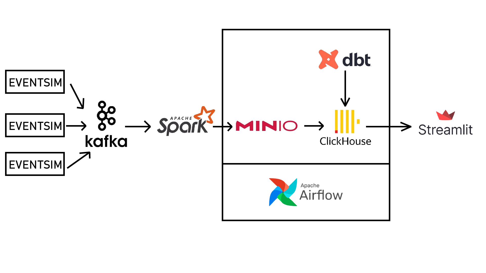
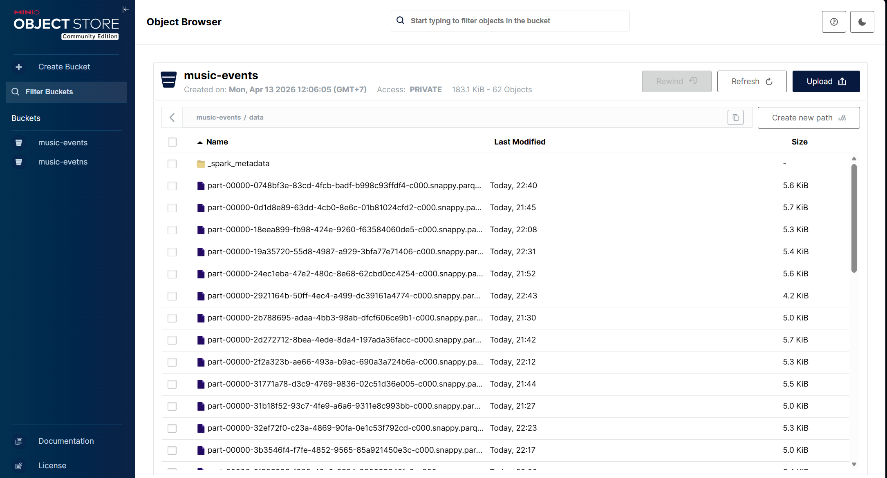
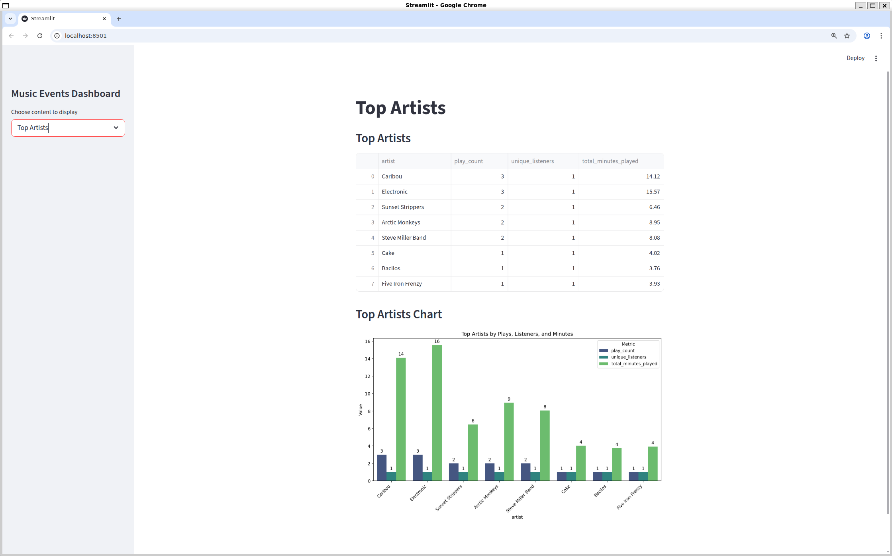

# Music Events Data Pipeline

A comprehensive, real-time data engineering pipeline simulating a music streaming platform's analytics. 

## 🗺️ Architecture Overview
This project simulates user listening behavior and pipes the data through an end-to-end modern data stack:
1. **EventSim:** Generates simulated JSON user interactions (plays, skips, signups).
2. **Kafka:** Captures streaming events as the primary message broker.
3. **PySpark (Structured Streaming):** Consumes Kafka topics, parses the data, and writes to Data Lake in Parquet format.
4. **MinIO:** Acts as the S3-compatible Object Storage (Data Lake).
5. **ClickHouse:** High-performance OLAP database connecting directly to our MinIO S3 bucket.
6. **DBT (Data Build Tool):** Applies transformations (ELT) inside ClickHouse to build staging schemas and data marts.
7. **Apache Airflow:** Orchestrates the manual Spark jobs, DBT models, and manages pipeline dependencies.


---

## 📁 Project Directory Structure

```text
~ (Home Directory)
├── eventsim_project/        # Main project repository
│   ├── airflow/             # Airflow DAGs and configurations
│   ├── dbt/                 # DBT models and macros for transformations
│   ├── kafka/               # Custom scripts for Kafka automation
│   ├── scripts/             # Shell scripts to manage services (start, stop, etc.)
│   ├── setup/               # Setup guides for each service (.md files)
│   ├── spark_streaming/     # PySpark structured streaming scripts
│   ├── docker-compose.yaml  # Docker Compose configuration for all services
│   └── README.md            # Project documentation
├── eventsim/                # EventSim (Data Generator) repository clone
├── kafka_2.13-3.6.1/        # Kafka installation binaries & properties
├── minio                    # MinIO server executable binary
└── MinIO/
    └── minio_data/          # MinIO Data Lake storage (Parquet files)
```
*Note: ClickHouse is installed system-wide (Global installation), which usually places executables in `/usr/bin/clickhouse` and data in `/var/lib/clickhouse/`.*

---

## 🛠️ Detailed Setup Guides
If you are deploying this for the first time, or need to rebuild a component, please refer to the detailed, step-by-step installation guides in the `setup/` directory:

- [Setup EventSim](setup/eventsim.md)
- [Setup Kafka](setup/kafka.md)
- [Setup MinIO](setup/minio.md)
- [Setup ClickHouse](setup/clickhouse.md)
- [Setup Spark](setup/spark.md)
- [Setup DBT](setup/dbt.md)

---

## 🚀 Quick Start
To spin up the entire pipeline, make sure you have granted execution p instances in the following order:

1. **Setup Virtual Environment** (If you haven't already):
   ```bash
   python3 -m venv ~/eventsim_project/venv
   source ~/eventsim_project/venv/bin/activate
   pip install -r ~/eventsim_project/requirements.txt
   ```

2. **Start Kafka & Zookeeper** (Depends on your local installation):
   ```bash
   python3 ~/eventsim_project/kafka/run_kafka.py
   ```
3. **Create the Kafka Topic** (Only needed the first time):
   Grant execution permission to the script:
   ```bash
   chmod +x ~/eventsim_project/scripts/*.sh
   ```
   Run the script:
   ```bash
   ~/eventsim_project/scripts/create_kafka_topic.sh
   ```
4. **Start the Data Stream**:
   ```bash
   ~/eventsim_project/scripts/run_eventsim_local.sh
   ```
   Turn on Kafka consumer to check the data stream:
   ```bash
   ~/eventsim_project/scripts/run_kafka_consumer_local.sh
   ```
5. **Start the Data Lake**:
   ```bash
   ~/eventsim_project/scripts/run_minio.sh
   ```
6. **Start Spark Processor**:
   Delete checkpoint folder (eventsim_project/checkpoints) and bucket music-events (MinIO Console) manually, then run this script
   ```bash
   ~/eventsim_project/scripts/run_spark.sh
   ```
   Turn on browser, go to http://localhost:9051/login, user: minioadmin, password: minioadmin
   
7. **Start Analytics Database**:
   ```bash
   ~/eventsim_project/scripts/run_clickhouse.sh
   ```
   *Important*: Initialize the tables manually when running locally by executing the SQL script:
   ```bash
   clickhouse-client --queries-file ~/eventsim_project/scripts/clickhouse_init_local.sql
   ```
   # And to interact with it:
   ```bash
   ~/eventsim_project/scripts/clickhouse_client.sh
   ```
8. **Orchestrate Transformations**:
   ```bash
   ~/eventsim_project/scripts/run_airflow.sh
   ```
   Then open the Airflow Web UI to trigger the DAG manually:
   - Go to **http://localhost:8080** and log in (username: `admin`, password: `admin`)
   - Find the DAG named **`music_events_pipeline`** in the list
   - Click the **toggle** on the left to unpause it (if it's grey/off)
   - Click the **▶ Trigger DAG** button (play icon on the right) to run it manually
   - Click on the DAG name to monitor the progress of each task in the Graph view
9. **Run app to check the result**:
   ```bash
   ~/eventsim_project/scripts/run_app.sh
   ```
   

---

## 🐳 Alternative: Run with Docker + Manual EventSim

This approach runs all infrastructure services (Kafka, MinIO, Spark, ClickHouse, Airflow) inside Docker, while EventSim is run manually from your local machine to push data into the Dockerized Kafka.

> **Why run EventSim manually?** EventSim uses an old Kafka client library that is incompatible with modern Kafka (3.x). The workaround is to pipe its output through the local `kafka-console-producer.sh` tool, which only works correctly when run on the host machine.

### Prerequisites
- Docker Desktop is running
- All scripts have execution permission: `chmod +x ~/eventsim_project/scripts/*.sh`

### Step-by-step

1. **Start all infrastructure services** (Kafka, MinIO, Spark, ClickHouse, Airflow):
   ```bash
   cd ~/eventsim_project
   docker compose up -d
   ```
   Wait ~30 seconds for all services to initialize.

2. **Verify services are healthy**:
   ```bash
   docker compose ps
   ```
   All containers should show status `running` or `exited (0)` for init containers.

3. **Start the EventSim data stream** (runs on local machine, pushes to Docker Kafka on port 29092):
   ```bash
   ~/eventsim_project/scripts/run_eventsim_docker.sh
   ```
   Open additional terminals and run the same script to increase data throughput.

4. **Verify data is reaching Kafka** (optional check):
   ```bash
   ~/eventsim_project/scripts/run_kafka_consumer_docker.sh
   ```
   You should see JSON events streaming in. Press `Ctrl+C` to stop.

5. **Monitor Spark writing to MinIO**:
   - Open MinIO Console: **http://localhost:9051** (user: `minioadmin`, pass: `minioadmin`)
   - Navigate to bucket **`music-events`** → folder **`data/`**
   - Parquet files should appear within 1–2 minutes of EventSim running.

6. **Trigger the Airflow DAG**:
   - Open Airflow UI: **http://localhost:8080** (user: `admin`, pass: `admin`)
   - Find DAG **`music_events_pipeline`** → unpause it → click **▶ Trigger DAG**

7. **View the results**:
   - Open the Streamlit app: **http://localhost:8501**
   - Or run it locally: `~/eventsim_project/scripts/run_app.sh`

### Stop all services
```bash
docker compose down
```
To also remove all data volumes (clean slate):
```bash
docker compose down -v
```